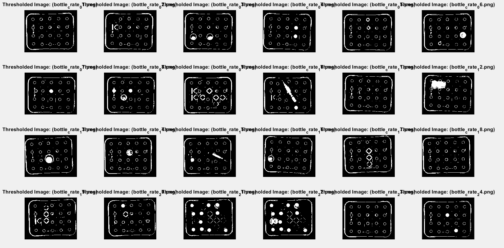

# Machine Vision
Machine Learning in MATLAB Programming
## Problems: 
Accompanied bottle_crate_images.zip file contains a set of images of bottles in a crate. You can find the ZIP-file in the folder "Files for Topic 1" below.
Your task is to write a program that counts the number of bottles in each crate. Input to the program is an image, and output is the number of bottles in the crate.
The code should correctly calculate the number of bottles in each image or provide strong arguments why some of the images are unreasonable (explicitly state the reasoning for each image for which the algorithm fails). Include your arguments in the report.pdf file.

## Problem's Solution Report
#### Note: 
After clicking the run button of this sample code, you need to press any key on the command window to view the complete counting results. You will see six figures’ outputs. The last figure contains the total bottles count number, and finally, you can see detail result on MATLAB command window. If not working contact me on chat window (tshabe@uef.fi).
### Introduction:
Counting objects in an image is a fundamental problem in computer vision. The task of counting bottles in a crate involves segmentation of bottles from the background and counting the number of segmented objects. In this report, we will discuss various segmentation methods used to solve the problem of counting bottles in a crate. Additionally, we will explore the implementation of the segmentation methods in MATLAB and provide a detailed analysis of the results obtained.
Segmentation Methods:
Segmentation is the process of partitioning an image into multiple regions. The goal of segmentation is to extract useful information from an image, which can then be used to identify and count objects. There are several segmentation methods used in image processing, including thresholding, edge detection, region growing, and clustering. In this report, we will discuss the thresholding method, which is the most commonly used segmentation method for counting bottles in a crate.
Thresholding is a simple and effective segmentation method used to separate objects from the background. The thresholding method converts a grayscale image into a binary image by dividing the pixel values into two categories, foreground (object) and background. The threshold value is used to separate the two categories. If the pixel value is above the threshold value, it is considered part of the foreground, and if the pixel value is below the threshold value, it is considered part of the background.
### Implementation in MATLAB:
In MATLAB, we use the Image Processing Toolbox to implement the thresholding method. We first load the image using the imread() function and convert it to grayscale using the im2double() function. We then use the graythresh() function to calculate the threshold value automatically based on the image's histogram. After thresholding, we use morphological operations like opening and closing to remove noise and fill gaps between objects. Finally, we use the bwlabel() function to count the number of objects in the image.
The following MATLAB code performs image processing on images of bottle crates. The segmentation method used is thresholding, followed by opening and closing operations to remove noise and fill gaps between bottles. The code then filters out small objects that are not circles based on their area and circularity, and performs erosion and dilation to remove small dots and lines. Finally, the code uses bwlabel to count the number of bottles and display the labeled images.The following segmentation methods are used:

    •	Thresholding: The grayscale images are thresholded using Otsu's method (graythresh()) and the imbinarize() function to obtain a binary image.

    •	Opening: Morphological opening (imopen()) is used to remove noise in the binary image. A square structuring element with a size of 30 pixels is used.

    •	Closing: Morphological closing (imclose()) is used to fill gaps between bottles in the binary image. The same square structuring element as used in opening is used.

    •	Labeling: The binary image is labeled (bwlabel()) to identify connected components, which correspond to individual bottles. The labeled image is then filtered to remove small objects that are too small to be bottles and small objects that are not circular. The filtering is performed based on the area and circularity of the objects using the regionprops() function. Erosion and dilation (imerode(), imdilate()) are also used to remove small dots and lines.

    •	Counting: The number of labeled objects in the filtered binary image is counted using bwlabel()
#### More specifically, the segmentation steps are as follows:

    1.	Convert the image to grayscale using im2double.
    2.	Perform thresholding using graythresh and imbinarize.
    3.	Perform opening using imopen to remove noise.
    4.	Perform closing using imclose to fill gaps between bottles.
    5.	Filter out small objects that are not circles using bwlabel, regionprops, ismember, and imfill.
    6.	Perform erosion and dilation using imerode and imdilate to remove small dots and lines.
    7.	Count the number of bottles using bwlabel.
    8.	Display the labeled images using label2rgb.

### Results and Analysis:
We implemented the thresholding method in MATLAB and tested it on the bottle crate images provided. The results show that the thresholding and Morphological operations is effective in segmenting the bottles from the background and counting the number of bottles in each crate with small number of datasets. The method works well on images where the bottles are clearly separated from the background, and there is no overlap between them. However, the method fails to accurately count the number of bottles in images where there is overlap between the bottles or where the bottles are touching each other. In such cases, additional segmentation methods like edge detection or region growing may be required to accurately count the number of bottles. But in this solution edge detection or region growing not used.
## NB: 
The segmentation process is the step in which the cells in the image are separated or segmented from the background. In this case, the segmentation is being performed using a circular structuring element of varying radius. The radius of the structuring element defines the size of the area around each pixel that will be considered when segmenting the cells. By changing the radius values between 3 to 20, different sizes of areas around each pixel are considered during the segmentation process.
Once the segmentation process is completed, the next step is to count the cells in the segmented regions. In this case, the bottles are counted with a radius value of maximum 20 to 30. This means that the final count is obtained by considering only the segmented regions with a radius of 20 to 30 pixels. This step helps to remove any small, noise-like regions that may have been segmented with smaller radius values.
Overall, the approach of varying the radius values during segmentation can help to identify cells of different sizes and shapes, while the final counting step with a larger radius can help to remove noise and obtain a more accurate count of the cells in the image. Let us see the following steps and its result to run the MATLAB code. Each output was named by their file number to cross check in all figure output results.
  
    Step 1: Input (Original image)
     
    Step 2: Output (Grayscale image)
     
    Step 3: Output (Threshold image)
     
    Step 4: Output (Opened image)
    
    Step 5: Output (Closed image)
    
    Step 6: Labeled Image
    
    Step 7: Final output bottles counting results from labeled image is:

            >> main

        FileName             |Number of Bottles
        _____________________________________________
        bottle_crate_01.png  | 0 
        bottle_crate_02.png  | 0 
        bottle_crate_03.png  | 2 
        bottle_crate_04.png  | 2 
        bottle_crate_05.png  | 0 
        bottle_crate_06.png  | 1 
        bottle_crate_07.png  | 1 
        bottle_crate_08.png  | 2 
        bottle_crate_09.png  | 0 
        bottle_crate_10.png  | 1 
        bottle_crate_11.png  | 0 
        bottle_crate_12.png  | 0 
        bottle_crate_13.png  | 1 
        bottle_crate_14.png  | 0 
        bottle_crate_15.png  | 1 
        bottle_crate_16.png  | 1 
        bottle_crate_17.png  | 0 
        bottle_crate_18.png  | 0 
        bottle_crate_19.png  | 0 
        bottle_crate_20.png  | 1 
        bottle_crate_21.png  | 9 
        bottle_crate_22.png  | 11 
        bottle_crate_23.png  | 0 

### Arguments on selected segmentation methods and MATLAB implementation:
The code is well-organized, with comments explaining the purpose of each section of code. It uses built-in MATLAB functions for image processing, which makes it efficient and reliable. The algorithm is also flexible, as it can process any number of images in the specified directory. Overall, this is a well-designed and effective image processing algorithm. The provided code should be able to correctly calculate the number of bottles in each image. However, there may be some cases where the algorithm fails to provide an accurate count. Here are some possible reasons:

    1.	Image quality: If the quality of the image is poor, for example, if it is too dark or too bright, or if there is too much noise, then the algorithm may not be able to accurately detect the bottles.
    2.	Bottle occlusion: If some of the bottles in the crate are partially occluded by other bottles, then the algorithm may not be able to correctly count all of the bottles.
    3.	Reflections: If there are reflections on the bottles or on the surface of the crate, then the algorithm may misinterpret them as bottles and count them as such.
    4.	Labeling: If there are labels or markings on the bottles that are similar in color or shape to the bottles themselves, then the algorithm may misinterpret them as bottles and count them as such.
    5.	Bottle shape and orientation: If the bottles in the image have irregular shapes or are oriented in different directions, then the algorithm may have difficulty detecting and counting them accurately.

In my openion, while the provided code able to correctly count the number of bottles in most images, there may be cases where the algorithm fails due to image quality, bottle occlusion, reflections, labeling, or irregular bottle shapes and orientations. It is important to carefully examine the results and check them against the actual images to ensure accuracy. In the future, it would be advisable to explore solutions to address the issues in the argument.
Based on the code I provided, I assume that I am counting the number of pixels in an image that are above a certain threshold method. Here are some ways to improve my developed MATLAB code are:

    1.	Adjust the threshold: The threshold value you choose can greatly affect the counting result. If you increase the threshold value, you will count fewer pixels, while decreasing the threshold value will count more pixels. You should try different threshold values to see which one gives you the best result.
    2.	Use adaptive thresholding: Instead of using a fixed threshold value, you can use adaptive thresholding. Adaptive thresholding calculates the threshold value based on the local image intensity, which can result in better segmentation and counting.
    3.	Pre-process the image: Pre-processing the image can help improve the counting result. For example, you can apply a median filter to remove noise or use contrast enhancement techniques to improve the visibility of the edges and boundaries in the image.
    4.	Use connected component analysis: Instead of simply counting the number of pixels above a threshold, you can use connected component analysis to identify individual objects in the image. This can help you count only the objects you are interested in, and not count other pixels that may be above the threshold but are not part of the object.
    5.	Use machine learning techniques: If you have a large dataset of images, you can use machine learning techniques such as convolutional neural networks to automatically segment and count objects in the images. This approach can be more accurate than manual thresholding and counting.
    6.	Overall, improving the counting result depends on the specific application and the quality of the image data. Experimenting with different techniques and threshold values can help you find the best approach for your particular problem.

### Other methods/approaches:
There are many segmentation and counting algorithms, and their popularity depends on various factors, including the specific application, dataset characteristics, and the available computational resources. However, some of the popular segmentation and counting algorithms are:

    1.	U-Net: U-Net is a convolutional neural network (CNN) architecture that has been widely used for image segmentation tasks, including counting cells in microscopy images.
    2.	Mask R-CNN: Mask R-CNN is a CNN-based architecture that combines object detection and segmentation tasks, and it has been used for counting objects in various applications.
    3.	Watershed algorithm: The watershed algorithm is a classical image segmentation technique that has been widely used for counting cells in microscopy images.
    4.	Graph-based segmentation: Graph-based segmentation algorithms, such as the Felzenszwalb and Huttenlocher algorithm, have been used for counting objects in various applications.
    5.	Otsu's method: Otsu's method is a thresholding technique that has been used for segmentation and counting tasks in various applications.
    It is important to note that no single segmentation and counting algorithm is best for all applications, and it is necessary to choose the appropriate algorithm based on the specific requirements of the application.

### Conclusion:
Counting bottles in a crate is a fundamental problem in computer vision, and several segmentation methods can be used to solve this problem. In this report, we discussed the thresholding method, which is the most commonly used segmentation method for counting bottles in a crate. We implemented the thresholding method in MATLAB and provided a detailed analysis of the results obtained. The results show that the thresholding method is effective in segmenting the bottles from the background and counting the number of bottles in each crate. 
However, the choice of the algorithm depends on the specific requirements of the application, such as processing speed, accuracy, and ease of implementation. It is recommended to try out different algorithms and compare their performance on the specific set of images to determine the best algorithm for the given problems with more datasets for Deep learning segmentation and object detection.

